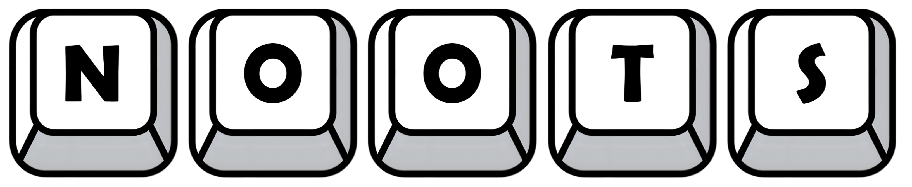

# Overview

Struggling to quit your Discord addiction? No worries! Meet your new note-taking sidekick that lives right inside Discord. This app offers a seamless note-taking experience between Discord and a minimal, lightweight web interface. Designed for easy to use, it allows you to create, organize, share notes, and set reminders easily—no matter where you're working from.

Built entirely with TypeScript, the app uses React for the frontend, and Node.js with Express for the backend. Data is stored in PostgreSQL, with Redis for caching. The Discord integration is handled through Discord.js, offering full note management through both Discord and the web interface.
